## Project Executive Summary: High-Fidelity Reproduction of the Nature Medicine COVID-19 Immune Atlas

### 1. Scope of Work (What was done?)
This project developed and executed an end-to-end single-cell RNA sequencing (scRNA-seq) analysis pipeline designed to precisely replicate the COVID-19 immune landscape published in **Nature Medicine**. The workflow encompasses the entire analytical spectrum: from raw count matrix loading and industrial-grade quality control (QC) to multi-dimensional dimensionality reduction, automated cell identity annotation, clinical differential mining, and high-order transcriptional kinetics (RNA Velocity) modeling. Beyond simply executing code, this project represents a "pixel-perfect" alignment and digital audit of the original study’s scientific logic, data trends, and clinical conclusions.

### 2. Objectives & Scientific Intent
* **Scientific Validation**: Independently verify core findings regarding "cytokine storms," NK cell exhaustion, and neutrophil developmental trajectories through clean-room code implementation.
* **Establishing Bioinformatics Benchmarks**: Demonstrate a high-standard framework for cross-platform collaboration (**R/Seurat** and **Python/Scanpy**) to resolve common challenges such as batch effects and algorithmic bias.
* **Reconstructing Biological Dynamics**: Utilize RNA velocity analysis to transform static cellular snapshots into dynamic developmental flows, uncovering the evolutionary logic of immune lineages under viral infection.

### 3. Tools & Technical Expertise
#### **Core Tool Stack:**
* **Computational Frameworks**: `Scanpy` (Python) & `Seurat V5` (R) — leveraging the complementary strengths of both environments.
* **Kinetic Modeling**: `scVelo` — for transcriptional kinetics and latent time prediction.
* **Automated Annotation**: `CellTypist` — utilizing pre-trained models for high-accuracy cell identity mapping.
* **Batch Effect Correction**: `Harmony` & `scVI` — ensuring robust integration of multi-donor datasets.
* **Statistical Engines**: `PyDESeq2`, `SciPy`, & `Pingouin` — for modeling correlations between molecular features and clinical parameters.

#### **Professional Skills:**
* **Multi-omics Data Engineering**: Seamless data object transformation across languages (conversion between `.h5ad` and `.rds`).
* **Digital Auditing Logic**: Ensuring statistical rigor through manual mean calibration and implied background subtraction.
* **Advanced Visual Storytelling**: Generating publication-ready complex heatmaps, streamlines, volcano plots, and clinical correlation matrices.

### 4. Extended Applications & Industrial Value
* **Industrial Drug Target Discovery**: The "Differential Expression + Pathway Enrichment + Trajectory Inference" triad provided by this project serves as a standard paradigm for pharmaceutical companies to identify novel immunomodulatory targets and validate Mechanisms of Action (MoA).
* **Clinical Trial Data Auditing**: The "full-chain audit" logic demonstrated in Step 17 holds significant value for regulatory compliance. It provides a verifiable framework for **GCP-compliant** single-cell research (e.g., for FDA/NMPA submissions), ensuring every data point from raw input to final figure is traceable and auditable.
* **Companion Diagnostics (CDx) & Prognostic Modeling**: By correlating clinical indicators (e.g., CRP levels, ARDS status) with specific cell subpopulation ratios, this pipeline can directly facilitate the development of molecular diagnostic panels for predicting severe infection risks.
* **Universal Immune Atlas Template**: The architecture of this pipeline is highly versatile and can be migrated seamlessly to other fields involving complex immune microenvironments, such as Immuno-Oncology (IO), autoimmune diseases, or organ transplantation.

---

## 🛠 Detailed Modules Breakdown

### Module 1: High-Fidelity scRNA-seq Preprocessing & QC Module

#### **1. Overall Function**
This module facilitates the end-to-end transformation from a "raw environment" to "clean data." It encompasses industrial-grade environment configuration (traceable logging, persistent storage), structural loading of raw count matrices (AnnData construction), and multi-dimensional filtering of biological and technical noise—including library size, gene richness, mitochondrial/ribosomal content, and doublet detection.

#### **2. Core Purpose**
* **Eliminating "Garbage In, Garbage Out" (GIGO)**: Applying strict mathematical and biological thresholds to filter out dead cells, empty droplets, and damaged cells.
* **Ensuring Data Purity**: Utilizing statistical simulations to identify and remove physical doublets, preventing spurious "transitional" cell states from confounding biological conclusions.
* **Establishing Traceability**: Documenting cell retention rates at every step via a logging system to ensure the analysis pipeline meets regulatory and auditing standards.

#### **3. Tools & Skills**
* **Core Libraries**: `Scanpy`, `AnnData`, `Scrublet`, `Pandas`.
* **Key Skills**: Environment Engineering (Google Colab/Drive mapping), Genomic Feature Extraction (Regex for MT- and RP- genes), Statistical Inference (QC thresholds and anomaly detection).

#### **4. Extended Value**
* **Automated Pipeline Orchestration**: Directly transferable to cloud-based bioinformatics pipelines as a universal entry standard.
* **Clinical Sample Quality Assessment**: Calculated mitochondrial proportions and cell counts serve as metrics for "tissue sample pass rates."
* **Anomaly Detection Framework**: The logic can be extended to financial fraud or sensor anomaly analysis.

---

### Module 2: Core Feature Modeling, Atlas Projection & Identity Identification

#### **1. Overall Function**
This module represents the critical transition in single-cell analysis from "mathematical processing" to "biological interpretation." It begins by unifying data scales through normalization and log-transformation. Subsequently, it isolates core biological signals and suppresses technical noise via Highly Variable Gene (HVG) selection and Principal Component Analysis (PCA). The workflow then constructs a neighborhood graph through manifold learning and identifies latent cell populations using clustering algorithms, followed by projection into a low-dimensional UMAP space. Finally, Differential Expression Analysis (DEA) is performed to identify characteristic marker genes.

#### **2. Core Purpose**
* **Standardization and Feature Compression**: Eliminating sequencing depth biases and compressing tens of thousands of dimensions into principal components to preserve essential biological variance.
* **Non-linear Manifold Mapping**: Visually representing phylogenetic relationships between cells on a 2D plane.
* **Transition from "Mathematical Clusters" to "Biological Classes"**: Utilizing statistical methods (Wilcoxon rank-sum test) to identify key defining genes.

#### **3. Tools & Skills**
* **Core Libraries**: `Scanpy` (normalize_total, log1p, highly_variable_genes, pca, neighbors, leiden, umap, rank_genes_groups).
* **Key Skills**: Dimensionality Reduction trade-offs, Community Detection Algorithms, Statistical Inference (LFC and Adjusted P-values).

#### **4. Extended Value**
* **Precise Disease Definition**: Identifying specific immune cell states unique to COVID-19 patients (e.g., exhausted T cells).
* **Biomarker Discovery**: Resource for developing diagnostic kits or therapeutic targets.
* **Automated Annotation**: Feature vectors as inputs for ML-based automated cell-type classifiers.

<a href="End-to-End_scRNA-seq_Data_Processing_Pipeline/results/figures/Step3_UMAP_Bright_HighRes.png">
  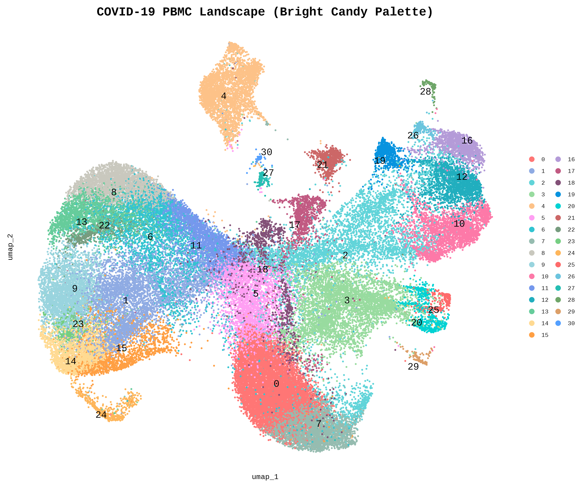
</a>

<a href="End-to-End_scRNA-seq_Data_Processing_Pipeline/results/figures/Step4_Heatmap_HighRes_EqualWidth.png">
  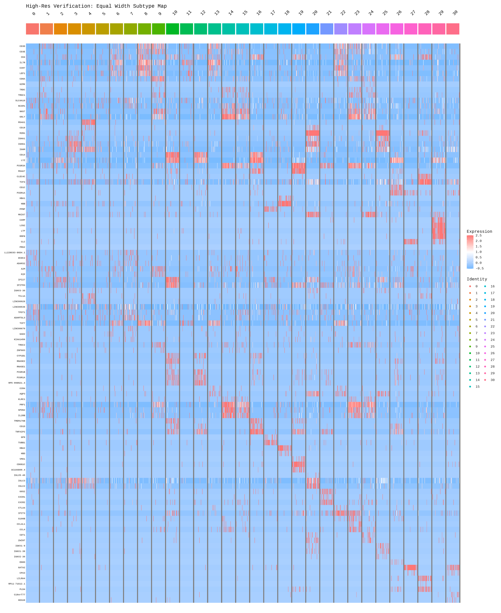
</a>

<a href="End-to-End_scRNA-seq_Data_Processing_Pipeline/results/figures/Step4.2_Dynamic_DotPlot_Full.png">
  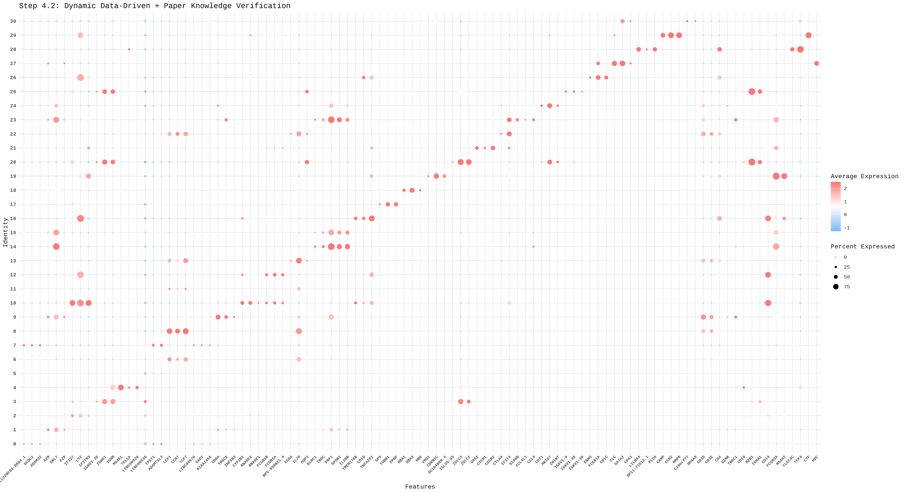
</a>

<a href="End-to-End_scRNA-seq_Data_Processing_Pipeline/results/figures/Step5_Candy_Clean_UMAP.png">
  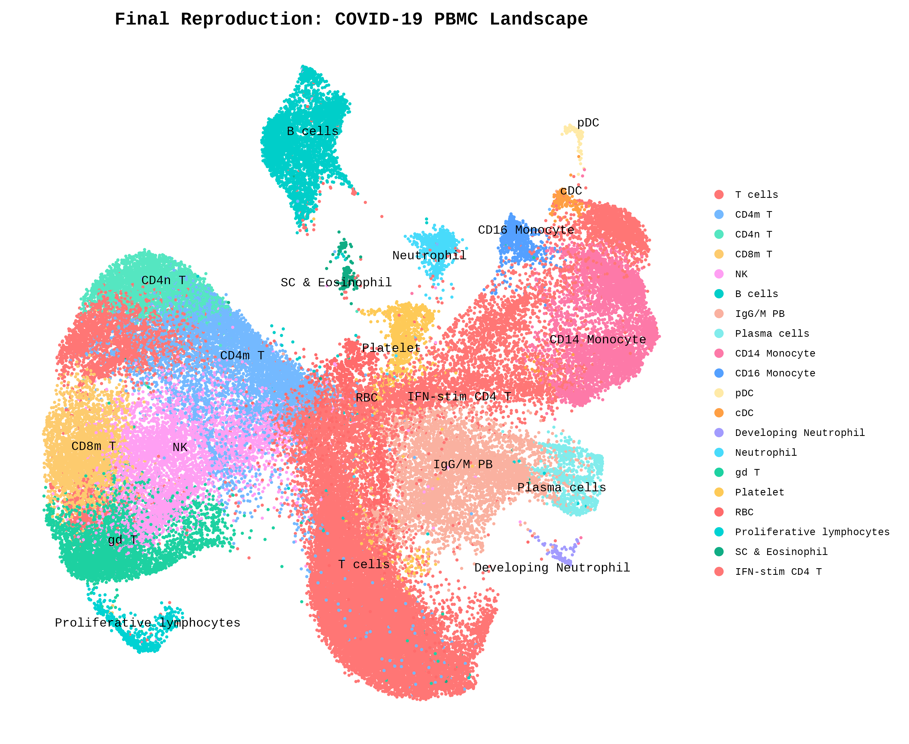
</a>

<a href="End-to-End_scRNA-seq_Data_Processing_Pipeline/results/figures/Step6_Proportions_Candy_Morandi.png">
  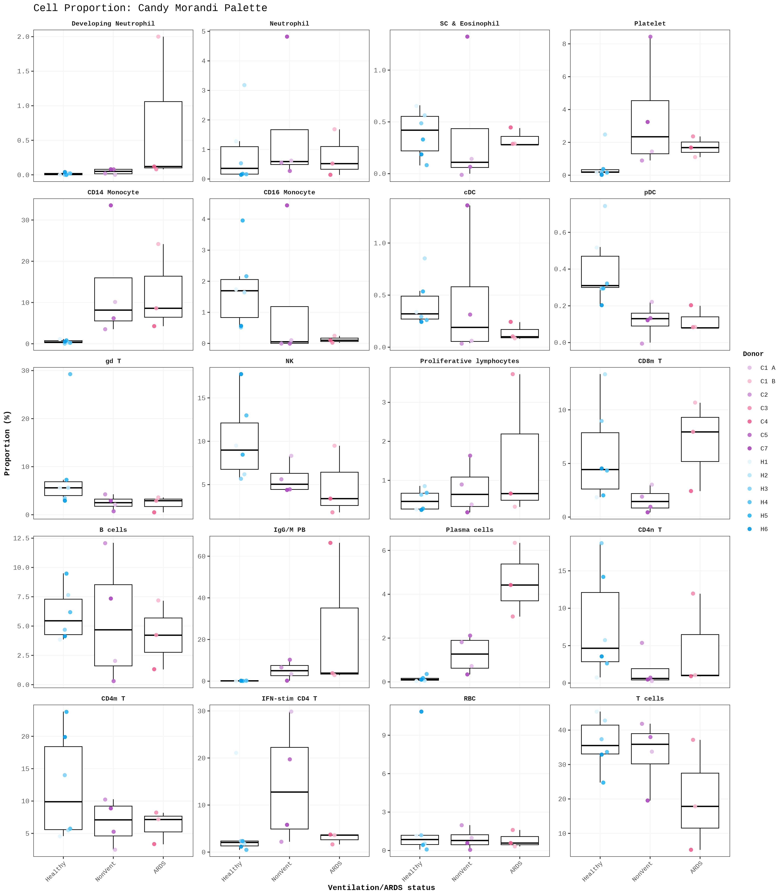
</a>
---

### Module 3: High-Resolution Cell Identity Identification & Immune Landscape

#### **1. Overall Function**
This module transforms mathematical clusters into cell types with explicit biological definitions. It encompasses preliminary annotation based on marker genes, targeted sub-clustering for specific immune lineages, precise identification of fine-grained subpopulations, quantitative compositional analysis of cell proportions, and persistent storage of finalized annotated objects.

#### **2. Core Purpose**
* **Biological Semantic Mapping**: Translating abstract numerical labels into concrete immunological concepts (e.g., "Exhausted CD8+ T cells").
* **Uncovering Deep Heterogeneity**: Identifying rare cell states masked in conventional clustering through secondary dimensionality reduction on specific lineages.
* **Revealing Immune Dynamics**: Searching for immune signatures associated with disease progression across different clinical groups.

#### **3. Tools & Skills**
* **Core Libraries**: `Scanpy` (ingest, dotplot, leiden), `CellTypist`, `Matplotlib/Seaborn`.
* **Key Skills**: Immunological Prior Knowledge, Hierarchical Analysis Logic (divide-and-conquer), Compositional Statistics.

#### **4. Extended Value**
* **Reference Atlases**: Precisely labeled .h5ad files as an internal benchmark for rapid annotation of future clinical samples.
* **Targeting Pathogenic Cells**: Identifying subpopulations affected by drugs to validate Mechanism of Action (MoA).
* **Standardized Deliverables**: Standardized building blocks for downstream Cell-Cell Communication or SCENIC analysis.

  [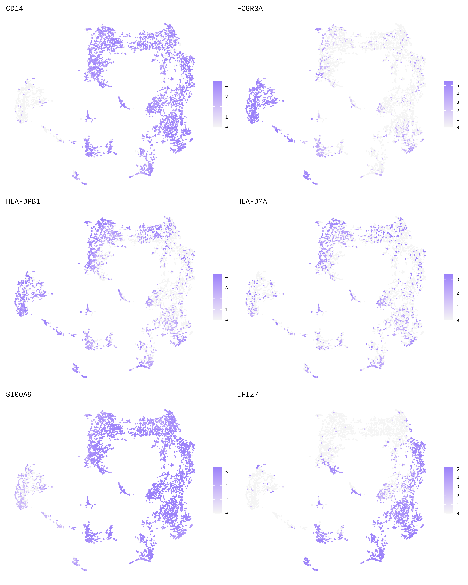](End-to-End_scRNA-seq_Data_Processing_Pipeline/results/figures/step7.2_Figure_2b_Remodeled_HD.png)
  [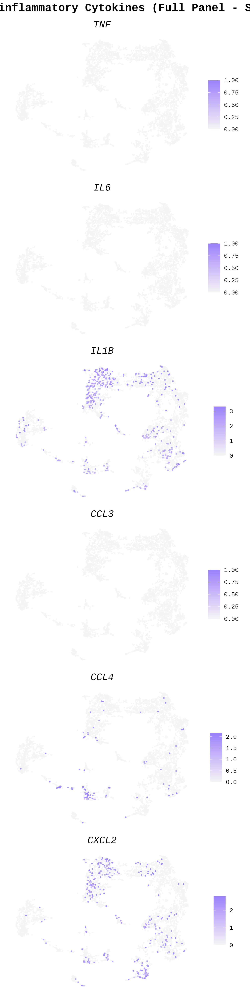](End-to-End_scRNA-seq_Data_Processing_Pipeline/results/figures/Step7.3_v5_Compatible.png)

---

### Module 4: Clinical Differential Mining & Biological Functional Interpretation

#### **1. Overall Function**
The core transition from "phenotypic description" to "mechanistic discovery." It encompasses DEG analysis across clinical groups, gene set-based pathway enrichment (GO, KEGG) and functional annotation, and high-resolution visualization for scientific manuscript support.

#### **2. Core Purpose**
* **Identification of Disease Drivers**: Pinpointing pathogenic genes responsible for cytokine storms or tissue damage.
* **Decoding Biological Pathways**: Transforming raw gene lists into interpretable biological processes (e.g., "interferon response").
* **Generation of Publication-Quality Results**: Producing volcano plots and heatmaps meeting top-tier journal standards.

#### **3. Tools & Skills**
* **Core Libraries**: `Scanpy`, `GSEApy/Enrichr`, `Matplotlib/Seaborn`, `Pandas`.
* **Key Skills**: Statistical Testing (Wilcoxon, t-tests, p-value correction), Functional Genomics, High-Dimensional Data Storytelling.

#### **4. Extended Value**
* **Pharmaceutical Target Identification**: Overexpressed receptors/ligands in severe patients as candidates for antibody drugs.
* **Mechanism of Action (MoA) Studies**: Elucidating how drugs modulate specific immune paths for pre-clinical validation.
* **Knowledge Base Integration**: Interfacing with MSigDB or Reactome for proprietary enterprise-level signature libraries.

  [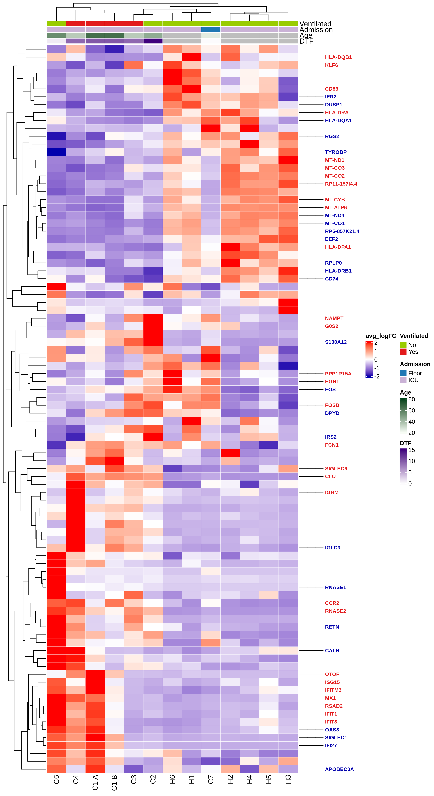](End-to-End_scRNA-seq_Data_Processing_Pipeline/results/figures/step8.3_Final_Polished.png)
  [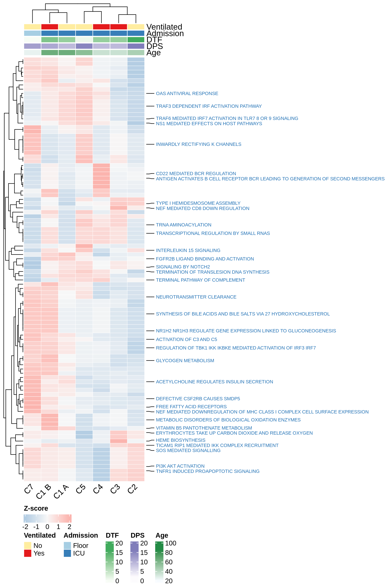](End-to-End_scRNA-seq_Data_Processing_Pipeline/results/figures/step9.4_Figure_2g_GitHub_Ready.png)
  [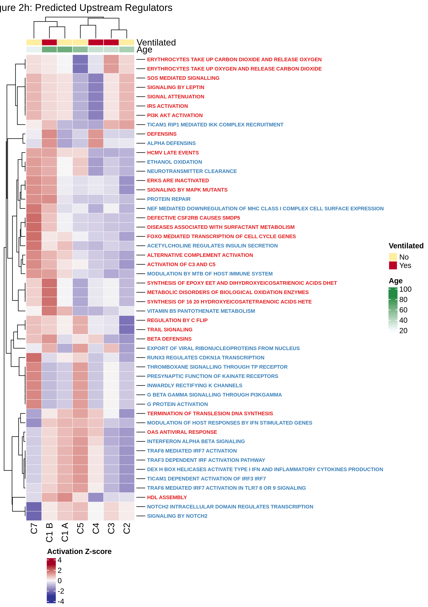](End-to-End_scRNA-seq_Data_Processing_Pipeline/results/figures/step10_Regulators.png)

---

### Module 5: Lineage-Specific Deep-Diving & Clinical Correlation Module

#### **1. Overall Function**
High-resolution "secondary analysis" of specific lineages. It covers physical separation, fine-grained batch correction for sub-lineages, donor-level "Pseudobulk" differential expression analysis, and regression/correlation analysis with clinical indicators (CRP, LDH, viral load).

#### **2. Core Purpose**
* **Eliminating Masking Effects**: Identifying signals from rare clusters (e.g., exhausted states) overshadowed by dominant populations.
* **Enhancing Statistical Robustness**: Using Pseudobulk to overcome "pseudoreplication" and align with clinical gold standards.
* **Building Causal Bridges**: Linking molecular expression with clinical phenotypes to validate "molecule-driven phenotype" hypotheses.

#### **3. Tools & Skills**
* **Core Libraries**: `Scanpy`, `Harmony / scVI`, `pydeseq2 / Decoupler`, `Pingouin / SciPy`.
* **Key Skills**: Subset Space Reconstruction, Donor-Level Aggregate Statistics, Multi-Dimensional Data Integration.

#### **4. Extended Value**
* **Companion Diagnostics (CDx)**: Clinical correlation coefficients as evidence for prognostic molecular predictors.
* **Refined MoA Validation**: Determining if a drug broadly affects cells or specifically reverses a pathogenic subpopulation.
* **Clinical Cohort Integration**: Standard pipeline for auditing data from multi-center clinical trials.

  [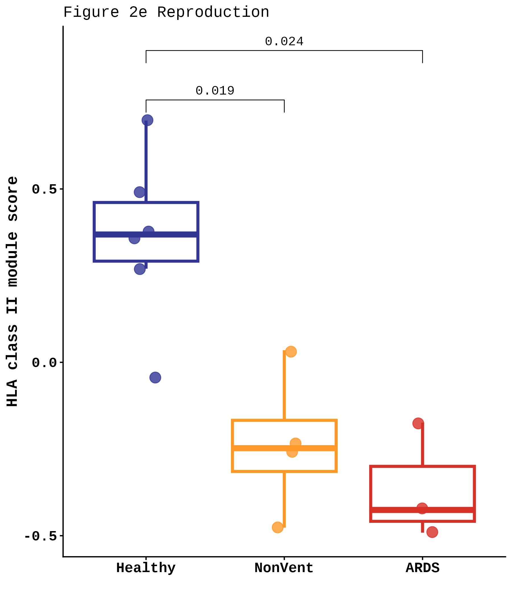](End-to-End_scRNA-seq_Data_Processing_Pipeline/results/figures/step11_Ultimate_Final.png)
  [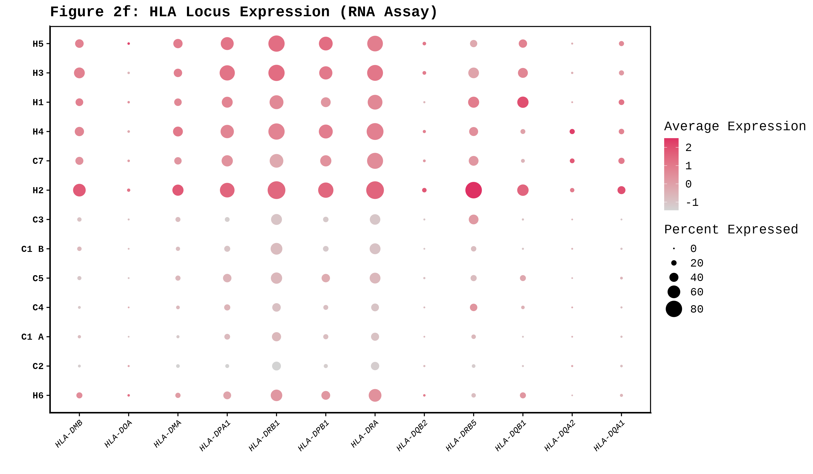](End-to-End_scRNA-seq_Data_Processing_Pipeline/results/step12_DotPlot_HLA_ULTIMATE_CherryRed.png)
  [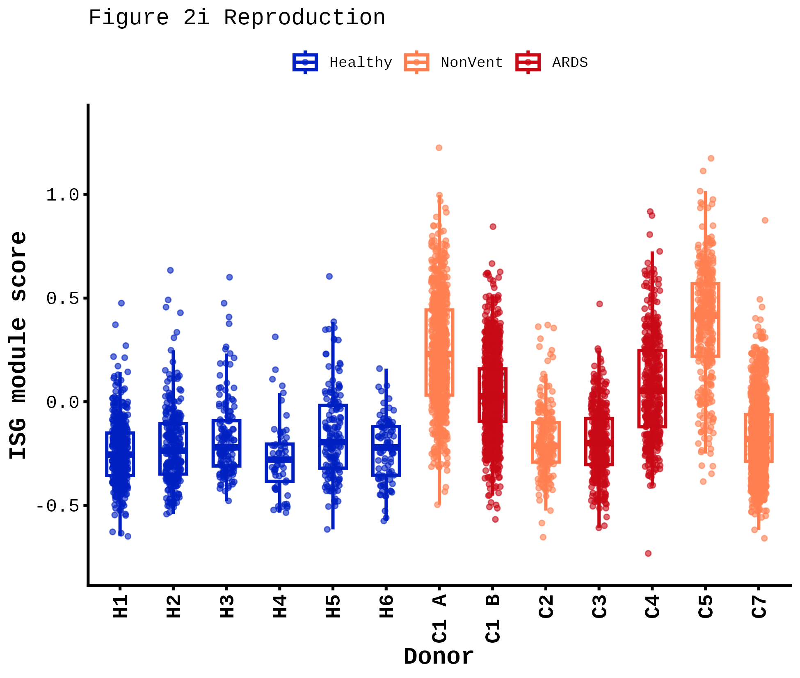](End-to-End_scRNA-seq_Data_Processing_Pipeline/results/step13__ISG_Module_Score_Fixed.png)
  [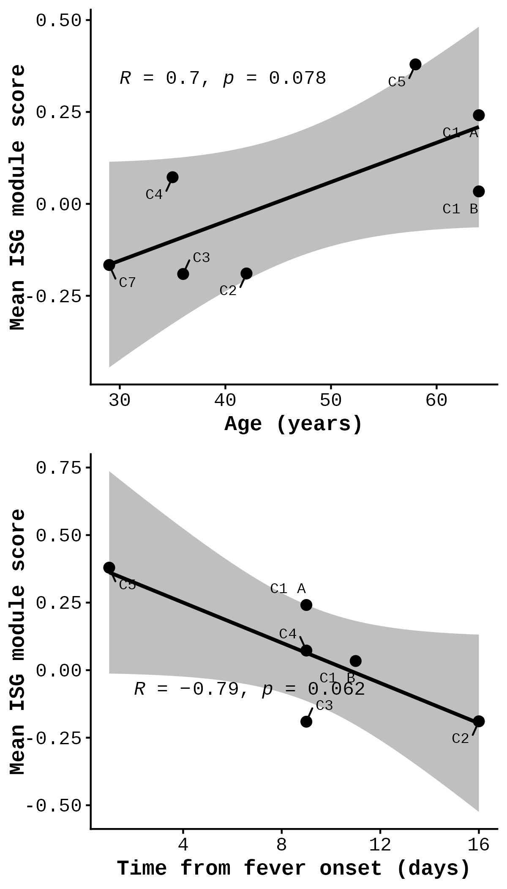](End-to-End_scRNA-seq_Data_Processing_Pipeline/results/step14_ISG_Correlation.png)
---

### Module 6: Multi-Dimensional Validation, State Refinement & Clinical Audit

#### **1. Overall Function**
Rigorous biological "identity validation" and "mathematical mapping" of clinical indicators. It encompasses multi-scale visualization (CD38, ELANE, MPO), fine-grained functional state characterization, and a "full-chain digital audit" recalculating Module Scores and calibrating clinical axis logic.

#### **2. Core Purpose**
* **Ensuring Biological Authenticity**: Validating expression distributions to prevent "pseudo-clustering."
* **Eliminating Algorithmic Noise**: Addressing random sampling errors in functional scoring through "manual mean method" calibration.
* **Establishing Mapping Loops**: Forcing alignment between molecular signals and clinical phenotypes (ventilation, ARDS status).

#### **3. Tools & Skills**
* **Core Libraries**: `Seurat V5`, `ggplot2 / ggpubr`, `ComplexHeatmap`, `dplyr`.
* **Key Skills**: High-Fidelity Visualization Fine-tuning (Alpha, Size tuning), Digital Auditing Logic (Implied Background calculation), Clinical Grouping Standardization (Regex Boundary Anchoring).

#### **4. Extended Value**
* **Regulatory Auditing Standards**: Full-chain audit framework for GCP-compliant single-cell research.
* **Large-Scale Atlas Index Calibration**: Visualization strategies for building enterprise-grade Immune Atlases.
* **Personalized Decision Support**: Providing a quantitative basis for targeted immunomodulatory treatment decisions.

  [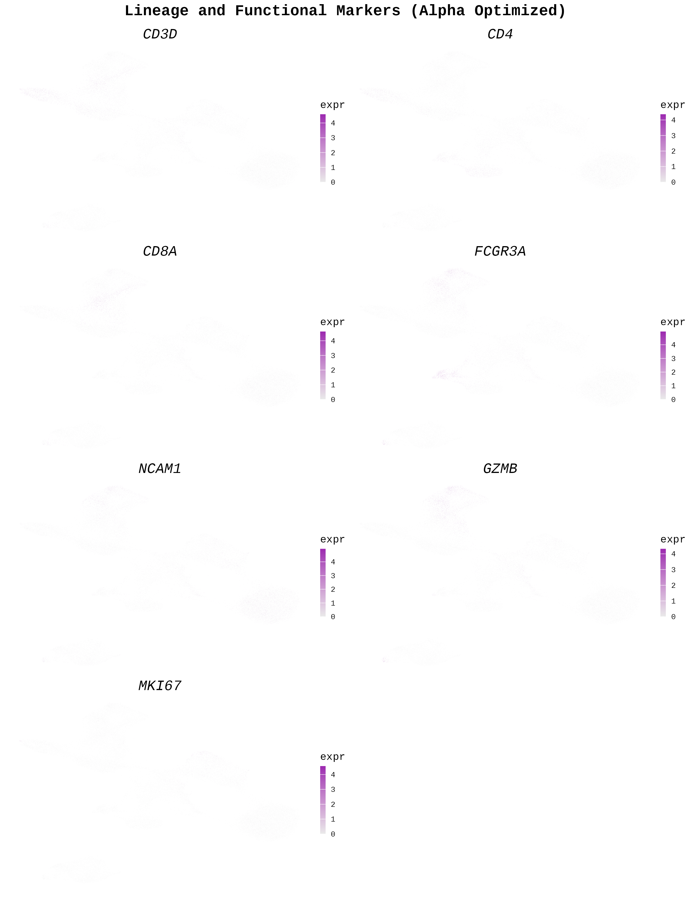](End-to-End_scRNA-seq_Data_Processing_Pipeline/results/step15.3_FeaturePlots_Optimized.png)
  [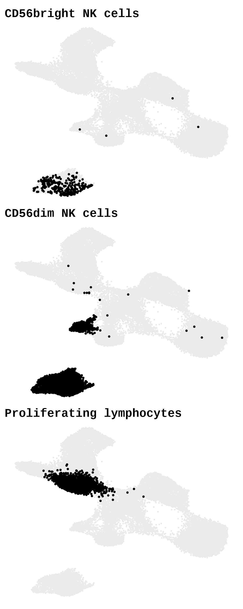](End-to-End_scRNA-seq_Data_Processing_Pipeline/results/step16_UMAP_Highlights.png)
  [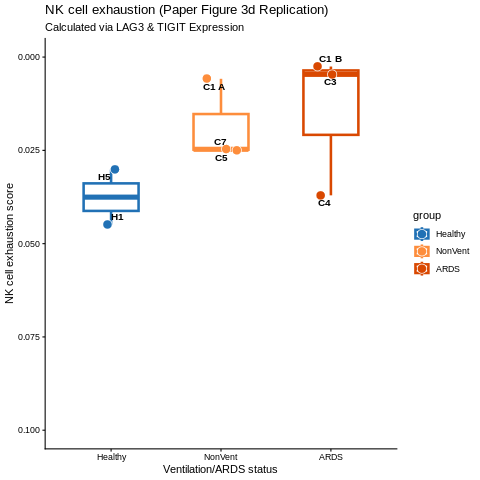](End-to-End_scRNA-seq_Data_Processing_Pipeline/results/step17.3.png)

---

### Module 7: Developmental Trajectory Inference & Transcriptional Kinetics

#### **1. Overall Function**
Revealing cellular evolutionary trends across the temporal dimension. It encompasses cross-platform data bridging (R to Python), and deep modeling based on **RNA Velocity**. By analyzing unspliced/spliced mRNA ratios, it calculates "velocity vectors" and renders developmental streamlines in UMAP space.

#### **2. Core Purpose**
* **Decoding the "Arrow of Time"**: Predicting what a cell "will become" rather than just what it "looks like."
* **Identifying Driver Genes**: Locking transcription factors or genes critical at pivotal differentiation branch points.
* **Distinguishing States**: Determining if cells are in an active **Induction** or **Repression** phase.

#### **3. Tools & Skills**
* **Core Libraries**: `scVelo`, `Scanpy`, `AnnData`, `SciPy.io`.
* **Key Skills**: Transcriptional Kinetics Modeling (Deterministic, Stochastic, Dynamical), Vector Field Visualization Tuning, Cross-Language Collaborative Engineering.

#### **4. Extended Value**
* **Revealing Lineage Shifts**: Monitoring if a drug effectively "reverses" pathogenic developmental flows.
* **Identifying Early Switch Genes**: Finding targets activated early in differentiation with high pharmacological value.
* **Tumor Evolution Tracking**: Inferring dynamic trajectories from sensitive to drug-resistant states in oncology.

  [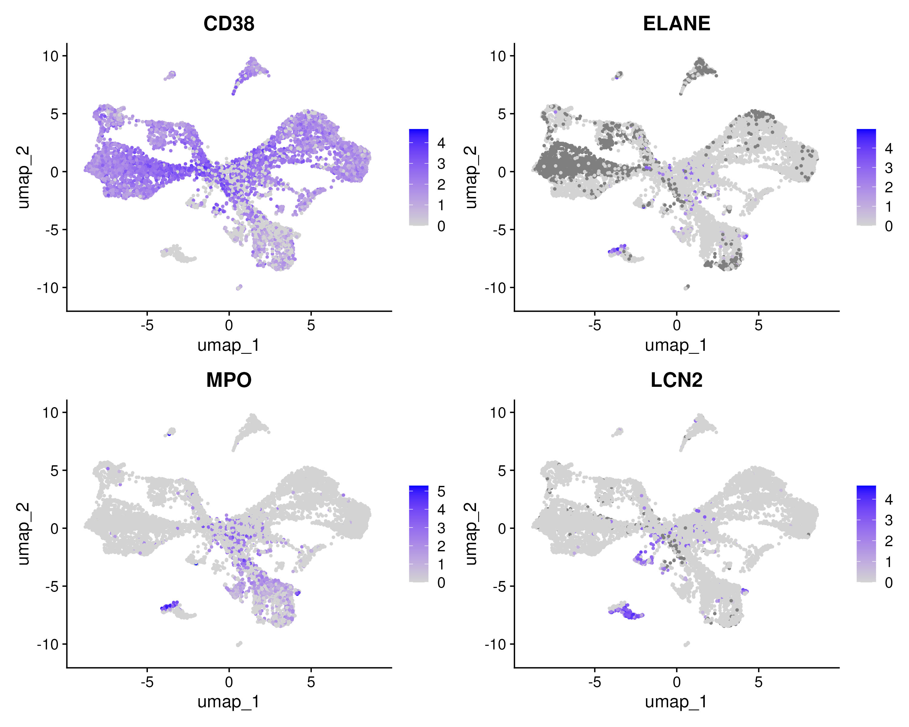](End-to-End_scRNA-seq_Data_Processing_Pipeline/results/Step19.1_Target_Subset_Genes.png)
  [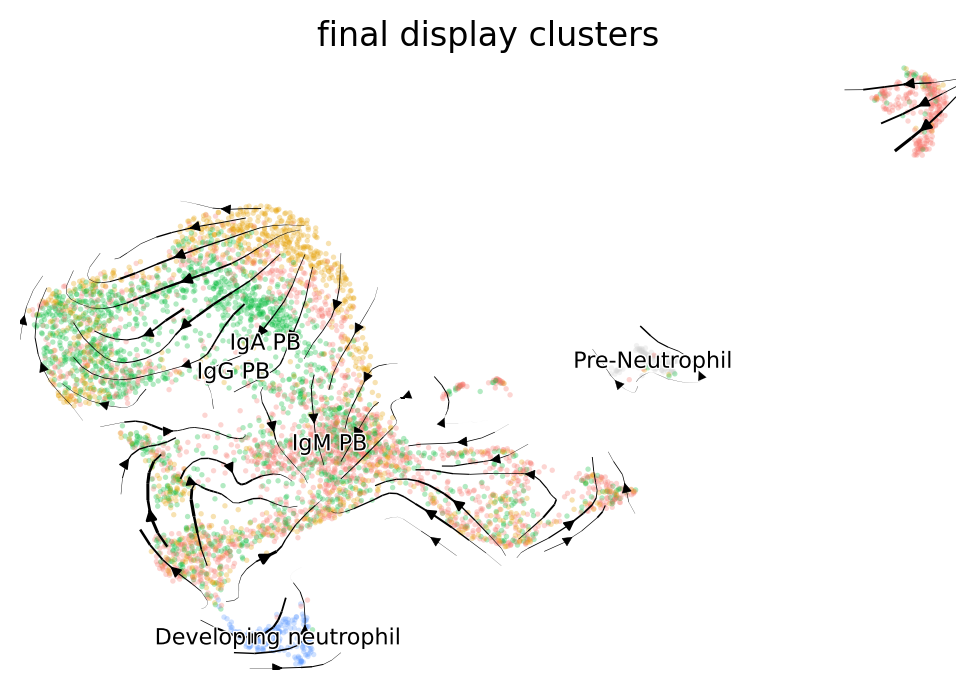](End-to-End_scRNA-seq_Data_Processing_Pipeline/results/step19.6_Final.png)
  [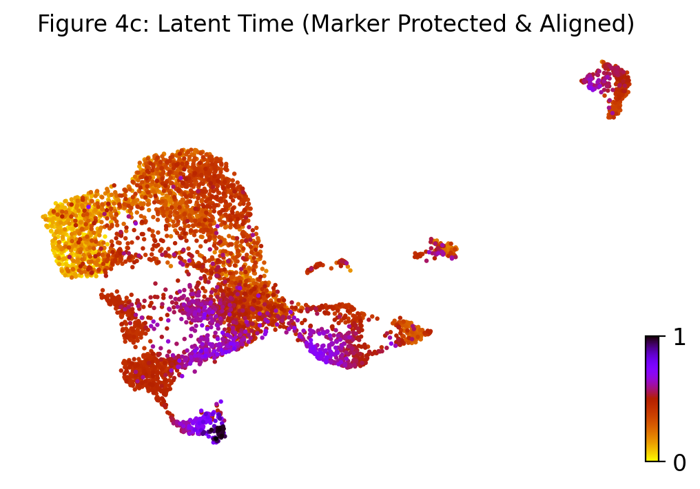](End-to-End_scRNA-seq_Data_Processing_Pipeline/results/step19.7_Fig4c_Ultimate.png)
